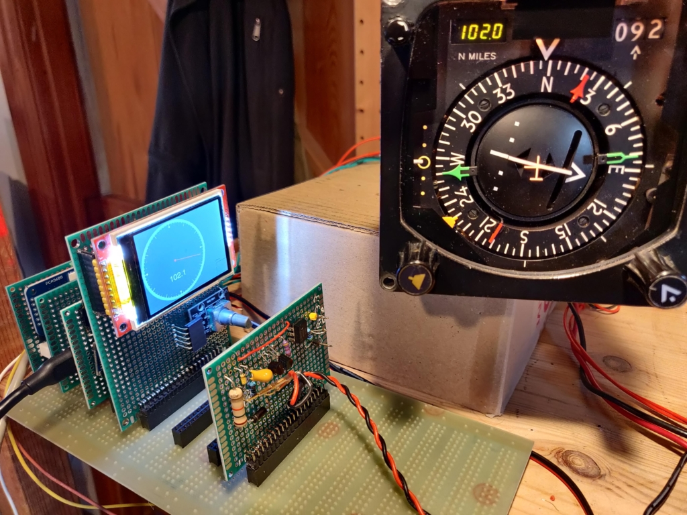
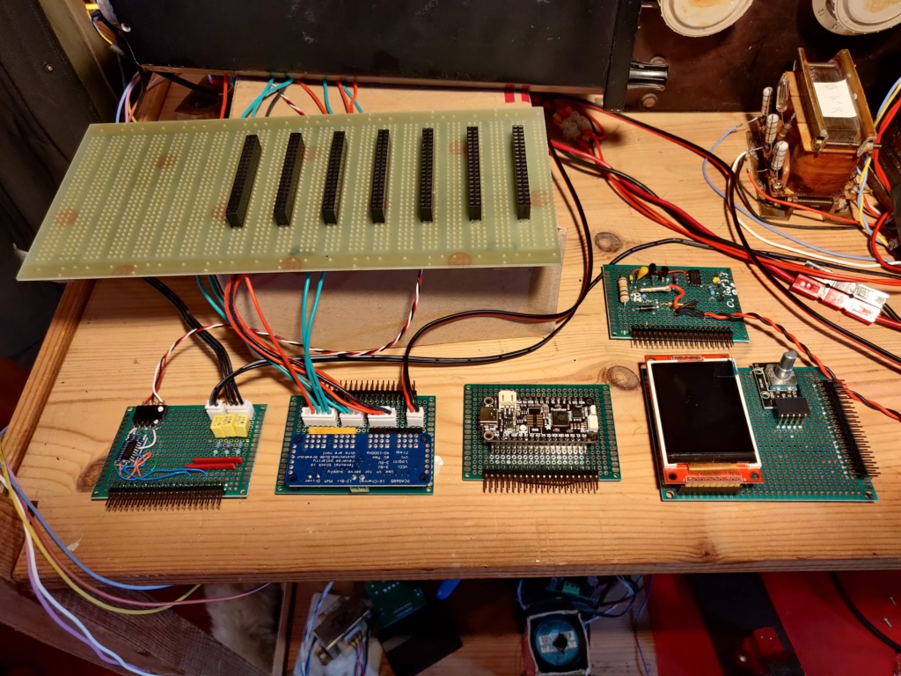

# Avation-Smiths-HSI
Horizontal Situation Indicator type HSI_WL332

## connections

see https://github.com/DavidJRichards/Aviation_Instruments/blob/main/HSI_WL332.md

## components

 * raspberry pi 2040
 * PCA9685 i2c pwm controller for driving galvos, flags, solenoids
 * max3232 Arinc transmitter
 * TFT eSPI display showing system status
 * Rotary encoder for menu / change settings
 * 400 Hz PWM generation for synchro transmitter
 * two audio amplifiers for driving synchro
 * three channel 400 Hz ADC reading heading control
 * 400Hz synchronisation input for servo reference
 * 400Hz reference frequency measurements

## Raspberry pi 2040 exercise firmware

[rp2040 sketch](./software/HSI-exerciser)

## photos

